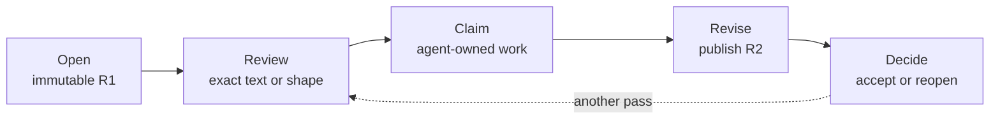

<div align="center">

# Tweakloop

**Review agent-made plans, docs, and diagrams without losing the thread.**

Tweakloop is a local-first review workspace for developers using coding agents. Open HTML,
Markdown, or Excalidraw in a browser, comment on the exact thing, let an agent publish a new
immutable revision, then accept it or ask for another pass.

[](https://github.com/Excoriate/tweakloop/actions/workflows/ci.yml)
[](LICENSE)

</div>



Each comment, agent task, revision, and human decision stays connected in one durable local
history. Live activity can disappear; committed workflow facts do not become mutable chat lore.

## Try it locally

You need [Node.js 24+](https://nodejs.org/),
[pnpm 10.12+](https://pnpm.io/installation), and
[`just`](https://github.com/casey/just).

```bash
git clone https://github.com/Excoriate/tweakloop.git
cd tweakloop
pnpm install --frozen-lockfile
just open examples/plan.html
```

Tweakloop builds the project, starts a workspace-local daemon, snapshots the example as an
immutable revision, and opens a one-time authenticated review URL. You should see the document,
its revision selector, Comment mode, and the collaboration rail.

On a headless host—or anywhere the platform browser opener is unavailable—replace the last line
with:

```bash
just build
node dist/cli/index.js open examples/plan.html --no-browser
```

Open the printed URL yourself. The source-checkout route is the supported starting point while
registry publication remains unverified.

## Why Tweakloop

- **Revisions, not a mutable preview.** Every publication is an immutable value with explicit
  ancestry. A prior result remains reviewable after the source file changes.
- **Feedback becomes work.** A comment can stay conversational or become typed, claimable work
  tied to the exact artifact and revision that produced it.
- **Agents are interchangeable.** Codex, Claude Code, Cursor, OpenCode, or any process that can
  invoke a CLI can use the same versioned protocol. Tweakloop does not host or special-case a
  model.
- **“Done” is not “accepted.”** Agent activity, claimed work, a returned revision, readiness for
  review, and the human decision remain separate facts.

## How the loop works

1. **Open.** Tweakloop registers the artifact and publishes its bytes as revision R1.
2. **Review.** You select an exact section, paragraph, or whiteboard element and describe the
   required change, constraint, or decision.
3. **Claim.** The assigned agent receives that precise work and claims it durably. Retries and
   handoffs cannot silently create a second owner.
4. **Revise.** The agent publishes R2 as a child of R1 and reports what it addressed.
5. **Decide.** You compare the result and accept it or reopen the work for another pass.

Tweakloop coordinates and records this review loop. It does not execute arbitrary repository
changes, host a model, replace Git, provide cloud sync, or promote an agent's completion to human
acceptance.

## What you can review

| Artifact | What Tweakloop preserves | Start here |
|---|---|---|
| HTML | semantic anchors, interactive rendering, immutable revisions | [`examples/plan.html`](examples/plan.html) |
| Markdown | heading ancestry, stable block anchors, safe rendering | [`examples/markdown-collaboration.md`](examples/markdown-collaboration.md) |
| Excalidraw | semantic nodes, edges, groups, managed drafts, immutable publication | [`examples/engineering-whiteboard.excalidraw`](examples/engineering-whiteboard.excalidraw) |

HTML plans can also embed managed whiteboards. The browser keeps Documents, Tasks, Comments, and
Chat in one session instead of scattering the review across unrelated tools.

## Connect your coding agent

Tweakloop ships a public agent skill with the complete safe workflow: open, inspect, claim, revise,
publish, complete, and hand the result back for a human decision.

```bash
npx skills add Excoriate/tweakloop --skill tweakloop
```

Then ask your agent:

> Use the Tweakloop skill to draft a plan for this change, open it for my review, address the
> feedback I submit, and return the revised artifact for acceptance.

The canonical public workflow is
[`.agents/skills/tweakloop/SKILL.md`](.agents/skills/tweakloop/SKILL.md); its installable copy is
[`skills/tweakloop/SKILL.md`](skills/tweakloop/SKILL.md). Both are standalone—personal workflow
harnesses are not shipped or required. For direct automation and output contracts, use the
[complete CLI reference](docs/cli-reference.md).

## Local-first by design

- One daemon owns one workspace and binds to loopback only.
- The review shell and untrusted artifact content run on separate origins; artifact content gets
  no shell credential or mutation route.
- SQLite stores an append-only event log, while immutable bytes live in a content-addressed object
  store. Current views are rebuildable projections.
- Human comments, default-human chat, accept, and reopen derive authority from the authenticated
  browser. CLI callers cannot label themselves human to bypass that boundary.
- The trust boundary is the local OS user. Tweakloop does not claim isolation from a hostile
  same-user process that can read another client's private files or memory.

See the [security policy](SECURITY.md),
[failure model](docs/architecture/14-failure-and-testing.md), and
[design laws](docs/design-principles.md) for the full contract.

## Project status

Tweakloop is **v0.1 alpha**. The core review loop runs end to end for HTML, Markdown, and
Excalidraw, including typed feedback, atomic agent claims, immutable child revisions, live browser
updates, and explicit human accept/reopen. The Chromium end-to-end suite exercises that loop, and
the CI workflow requires the suite on every pull request and `main` push.

Current boundaries matter:

- first-class evidence objects and verification records are not implemented yet; completion
  summaries, semantic checks, diffs, and human decisions are available today;
- automatic cross-revision anchor re-resolution and explicit orphan facts remain incomplete;
- owned-daemon restart and recovery paths are exercised, but arbitrary SIGKILL, power-loss, and
  cross-platform crash consistency are not claimed;
- Chromium is the primary browser test target; Firefox, WebKit, and screen-reader verification are
  still open.

The exact docs-to-code ledger lives in
[`docs/architecture/16-implementation-status.md`](docs/architecture/16-implementation-status.md).

## Contributing

Tweakloop keeps the domain small by making durable facts, identities, authority, and failure paths
explicit. Before modeling new behavior, read the
[design principles](docs/design-principles.md) and
[ubiquitous language](docs/ubiquitous-language.md).

```bash
pnpm install --frozen-lockfile
pnpm exec playwright install --with-deps chromium
just check e2e
```

That is the product-owned verification graph the CI workflow invokes: build, guide/skill/hook
projection parity, the OSS test suite, formatting/lint checks, and the real-browser loop. See
[`CONTRIBUTING.md`](CONTRIBUTING.md) for test and architecture expectations, and use
[GitHub Security Advisories](SECURITY.md#reporting-a-vulnerability) for private vulnerability
reports.

## Documentation

- [Start with the documentation map](docs/README.md)
- [Understand the product and non-goals](docs/prd.md)
- [Use the complete CLI reference](docs/cli-reference.md)
- [Read the architecture](docs/architecture/README.md)

## Acknowledgements

Tweakloop was partly inspired by [Lavish AXI](https://github.com/kunchenguid/lavish-axi), which
made precise feedback on agent-generated HTML feel immediate. Tweakloop extends that idea into a
durable, agent-neutral review workflow with immutable revisions and explicit human decisions.

## License

[MIT](LICENSE) © Alex Torres Ruiz.
