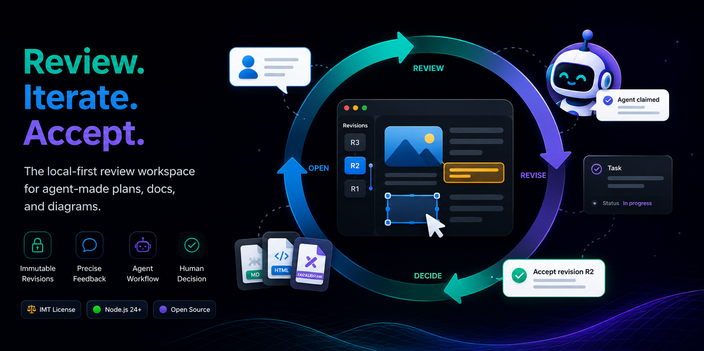
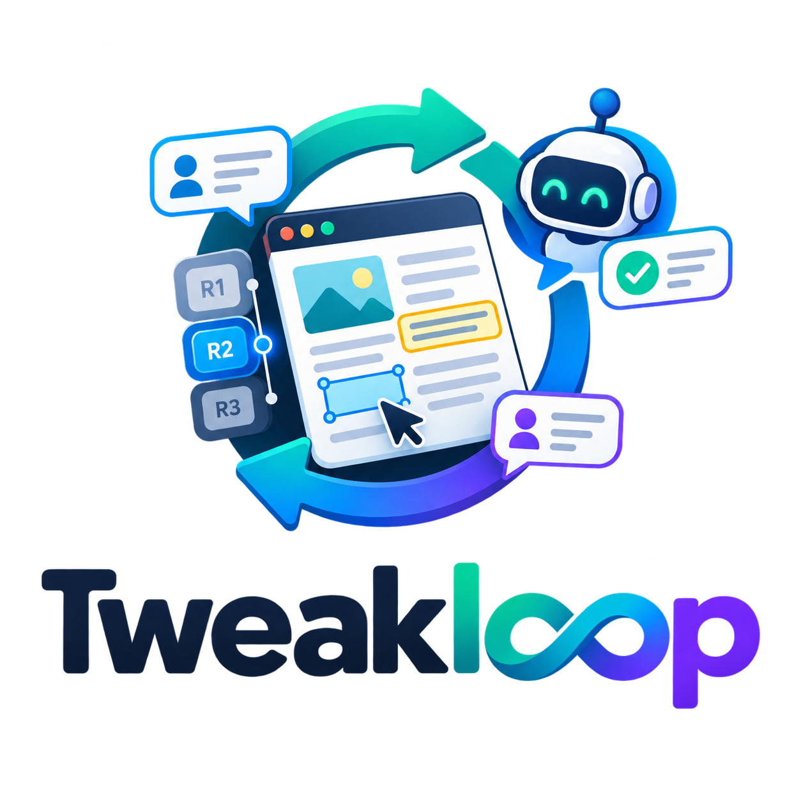

<div align="center">



# Tweakloop

**Review agent-made plans, docs, and diagrams without losing the thread.**

Your agent ships a plan. You comment in chat. It “fixes” something. Three revisions later, nobody
remembers what changed or what you accepted. Tweakloop is a **local review workspace** for that
loop: comment on the exact paragraph or shape, turn feedback into claimable agent work, publish
immutable revisions, and accept or reopen — nothing is done until you say so.

**v0.1 alpha** — the core loop works today for HTML, Markdown, and Excalidraw on your machine.
[What's ready and what's not →](#project-status)

[](https://github.com/Excoriate/tweakloop/actions/workflows/ci.yml)
[](LICENSE)
[](#project-status)
[](https://nodejs.org/)

[Quickstart](#try-it-locally) · [Why](#why-tweakloop) · [How it works](#how-the-loop-works) · [Agent setup](#connect-your-coding-agent) · [Docs](#documentation)

<div align="center">

<a href="https://github.com/Excoriate/tweakloop/blob/main/assets/tweakloop-demo.mp4">
  
</a>

**[▶ Watch the demo](https://github.com/Excoriate/tweakloop/blob/main/assets/tweakloop-demo.mp4)** · [Direct download](assets/tweakloop-demo.mp4)

</div>

If this matches how you work with agents, **[star the repo](https://github.com/Excoriate/tweakloop)** for updates.

</div>

## Try it locally

You need [Node.js 24+](https://nodejs.org/),
[pnpm 10.12+](https://pnpm.io/installation), and
[`just`](https://github.com/casey/just).

```bash
git clone https://github.com/Excoriate/tweakloop.git
cd tweakloop
pnpm install --frozen-lockfile
just open examples/plan.html
```

This builds the project, starts a workspace-local daemon, snapshots the example as revision R1,
and opens a one-time authenticated review URL. You should see the document, its revision selector,
**Comment mode**, and the collaboration rail.

<details>
<summary>Headless or CI (no browser opener)</summary>

```bash
just build
node dist/cli/index.js open examples/plan.html --no-browser
```

Open the printed URL yourself.

</details>

## Why Tweakloop

Better than scattered agent chat and ad-hoc file edits when you need **accountability across
review rounds**:

- **Revisions, not a mutable preview.** Every publication is a new revision you can compare. An
  older result stays reviewable after the source file on disk changes.
- **Feedback becomes work.** A comment can stay conversational or become typed, claimable work
  tied to the exact artifact and revision that produced it.
- **Agents are interchangeable.** Codex, Claude Code, Cursor, OpenCode, or any CLI-capable
  process can use the same protocol. Tweakloop does not host or special-case a model.
- **“Done” is not “accepted.”** Agent activity, claimed work, a returned revision, readiness for
  review, and your decision remain separate facts.

## Who this is for

**For:** developers who use coding agents daily and review plans, architecture docs, or diagrams
before trusting them — and want that review to survive past the current chat thread.

**Not for:** replacing Git, hosting a model, cloud sync, or running arbitrary repo mutations from
the review shell. Tweakloop coordinates and records the review loop; it does not execute
implementation work on your codebase.

## How the loop works

| 🔁 Stage | 👤 You | 🤖 Agent | 📋 Output |
|---|---|---|---|
| Open | Publish an artifact for review | — | Revision R1 |
| Review | Select exact text or shape; leave typed feedback | — | Comments / intents |
| Claim | — | Takes ownership of the work durably | Claim receipt |
| Revise | — | Publishes a child revision | Revision R2+ |
| Decide | Accept or reopen | — | Human decision recorded |

<details>
<summary>Loop at a glance (ASCII)</summary>

<pre>
  Open R1 ──▶ Review ──▶ Claim ──▶ Revise R2 ──▶ Decide
    ▲                                            │
    └──────────────── reopen ────────────────────┘
</pre>

</details>

1. **Open.** Tweakloop registers the artifact and publishes its bytes as revision R1.
2. **Review.** You select an exact section, paragraph, or whiteboard element and describe the
   required change, constraint, or decision.
3. **Claim.** The assigned agent receives that precise work and claims it durably. Retries and
   handoffs cannot silently create a second owner.
4. **Revise.** The agent publishes R2 as a child of R1 and reports what it addressed.
5. **Decide.** You compare the result and accept it or reopen the work for another pass.

## What you can review

| 📄 Artifact | ✨ What Tweakloop preserves | 👉 Start here |
|---|---|---|
| HTML | semantic anchors, interactive rendering, immutable revisions | [`examples/plan.html`](examples/plan.html) |
| Markdown | heading ancestry, stable block anchors, safe rendering | [`examples/markdown-collaboration.md`](examples/markdown-collaboration.md) |
| Excalidraw | semantic nodes, edges, groups, managed drafts, immutable publication | [`examples/engineering-whiteboard.excalidraw`](examples/engineering-whiteboard.excalidraw) |

HTML plans can also embed managed whiteboards. The browser keeps Documents, Tasks, Comments, and
Chat in one session instead of scattering the review across unrelated tools.

## Connect your coding agent

Install the public skill, then ask your agent to run the workflow:

```bash
npx skills add Excoriate/tweakloop --skill tweakloop
```

> Use the Tweakloop skill to draft a plan for this change, open it for my review, address the
> feedback I submit, and return the revised artifact for acceptance.

Choose the agent and project scope when prompted. The skill runs with that agent's permissions.
Full workflow: [agent skill](skills/tweakloop/SKILL.md) ·
[CLI reference](docs/cli-reference.md)

## Local-first by design

- Loopback-only daemon; review shell and artifact content on **separate origins** (artifact content
  has no shell credential or mutation route).
- Append-only local event log plus content-addressed bytes; human accept/reopen requires the
  authenticated browser session.
- Trust boundary is the local OS user — see [SECURITY.md](SECURITY.md) for the full model.

More: [failure model](docs/architecture/14-failure-and-testing.md) ·
[design principles](docs/design-principles.md)

## Project status

> **v0.1 alpha.** The core review loop runs end to end for HTML, Markdown, and Excalidraw —
> typed feedback, atomic agent claims, immutable child revisions, live browser updates, and
> explicit human accept/reopen. CI runs the Chromium end-to-end suite on every pull request and
> `main` push.

<details>
<summary>Known gaps (read before adopting deeply)</summary>

- First-class evidence objects and verification records are not implemented yet; completion
  summaries, semantic checks, diffs, and human decisions are available today.
- Automatic cross-revision anchor re-resolution and explicit orphan facts remain incomplete.
- Owned-daemon restart and recovery paths are exercised, but arbitrary SIGKILL, power-loss, and
  cross-platform crash consistency are not claimed.
- Chromium is the primary browser test target; Firefox, WebKit, and screen-reader verification
  are still open.

</details>

Exact docs-to-code ledger:
[`docs/architecture/16-implementation-status.md`](docs/architecture/16-implementation-status.md)

## Contributing

Read [CONTRIBUTING.md](CONTRIBUTING.md) for setup, `just check`, end-to-end tests, and architecture
expectations. Before modeling new behavior, read the
[design principles](docs/design-principles.md) and
[ubiquitous language](docs/ubiquitous-language.md).

Report vulnerabilities via [GitHub Security Advisories](SECURITY.md#reporting-a-vulnerability).

## Documentation

- [Start with the documentation map](docs/README.md)
- [Understand the product and non-goals](docs/prd.md)
- [complete CLI reference](docs/cli-reference.md)
- [Read the architecture](docs/architecture/README.md)

## Acknowledgements

Tweakloop was partly inspired by [Lavish AXI](https://github.com/kunchenguid/lavish-axi), which
made precise feedback on agent-generated HTML feel immediate. Tweakloop extends that idea into a
durable, agent-neutral review workflow with immutable revisions and explicit human decisions.

## License

[MIT](LICENSE) © Alex Torres.
